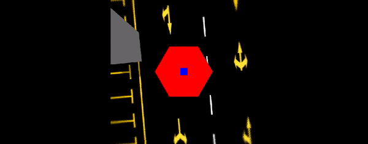

[![Contributors][contributors-shield]][contributors-url]
[![Forks][forks-shield]][forks-url]
[![Stargazers][stars-shield]][stars-url]
[![Issues][issues-shield]][issues-url]

<!-- PROJECT LOGO -->
 

  

  <h3 align="center">AVP-BEV-OPEN</h3>

  

    A pkg stiching around view images(4-6cameras) to generate bird's eye view!
     
    <a href="https://github.com/TurtleZhong/avp-bev-open">View Demo</a>
    ·
    <a href="https://github.com/TurtleZhong/avp-bev-open/issues">Report Bug</a>
    ·
    <a href="https://github.com/TurtleZhong/avp-bev-open">Request Feature</a>
  

<!-- TABLE OF CONTENTS -->

  
Table of Contents

  <ol>
    <li>
      <a href="#about-the-project">About The Project</a>
    </li>
    <li><a href="#roadmap">Roadmap</a></li>
    <li><a href="#contributing">Contributing</a></li>
    <li><a href="#license">License</a></li>
    <li><a href="#contact">Contact</a></li>
    <li><a href="#acknowledgements">Acknowledgements</a></li>
  </ol>

<!-- ABOUT THE PROJECT -->
### About The Project

  

* <a>Red->blind area which cameras can not see</a>
* <a>BLUE->Car body area</a>

&emsp;&emsp;Surround-view system is an important information medium for drivers to monitor the driving environment. A typical surround-view
system consists of four to six fish-eye cameras arranged around the
vehicle. From these camera inputs, a top-down image of the ground
around the vehicle, namely the surround-view image can be generated with well calibrated camera poses.

&emsp;&emsp; Our project aim at stiching around view images(4-6cameras) to generate bird's eye view! For some reason, we only release our simulation results in gazebo. **`Code will be released if possiable!`**

<!-- ROADMAP -->
### Roadmap

* [avm system]()
* [ADAS]()
* [bev segmentation]()
* [bev localiaztion]()
* [......]()

<!-- CONTRIBUTING -->
### Contributing

Contributions are what make the open source community such an amazing place to be learn, inspire, and create. Any contributions you make are **greatly appreciated**.

1. Fork the Project
2. Create your Feature Branch (`git checkout -b feature/AmazingFeature`)
3. Commit your Changes (`git commit -m 'Add some AmazingFeature'`)
4. Push to the Branch (`git push origin feature/AmazingFeature`)
5. Open a Pull Request

<!-- LICENSE -->
### License

Distributed under the MIT License.

<!-- CONTACT -->
### Contact

Xinliang Zhong - [@zxl](null) - xinliangzhong@foxmail.com

Project Link: [https://github.com/TurtleZhong/avp-bev-open](https://github.com/TurtleZhong/avp-bev-open)

<!-- ACKNOWLEDGEMENTS -->
### Acknowledgements
* [Open CV](https://opencv.org/)
* [ROS](http://wiki.ros.org/)
* [Gazebo](http://gazebosim.org/)

<!-- MARKDOWN LINKS & IMAGES -->
<!-- https://www.markdownguide.org/basic-syntax/#reference-style-links -->
[contributors-shield]: https://img.shields.io/github/contributors/TurtleZhong/avp-bev-open.svg?style=for-the-badge
[contributors-url]: https://github.com/TurtleZhong/avp-bev-open/graphs/contributors
[forks-shield]: https://img.shields.io/github/forks/TurtleZhong/avp-bev-open.svg?style=for-the-badge
[forks-url]: https://github.com/TurtleZhong/avp-bev-open/network/members
[stars-shield]: https://img.shields.io/github/stars/TurtleZhong/avp-bev-open.svg?style=for-the-badge
[stars-url]: https://github.com/TurtleZhong/avp-bev-open/stargazers
[issues-shield]: https://img.shields.io/github/issues/TurtleZhong/avp-bev-open.svg?style=for-the-badge
[issues-url]: https://github.com/TurtleZhong/avp-bev-open/issues
[license-shield]: https://img.shields.io/github/license/TurtleZhong/avp-bev-open.svg?style=for-the-badge
[license-url]: https://github.com/TurtleZhong/avp-bev-open/blob/master/LICENSE.txt
[linkedin-shield]: https://img.shields.io/badge/-LinkedIn-black.svg?style=for-the-badge&logo=linkedin&colorB=555
[linkedin-url]: https://linkedin.com/in/TurtleZhong

